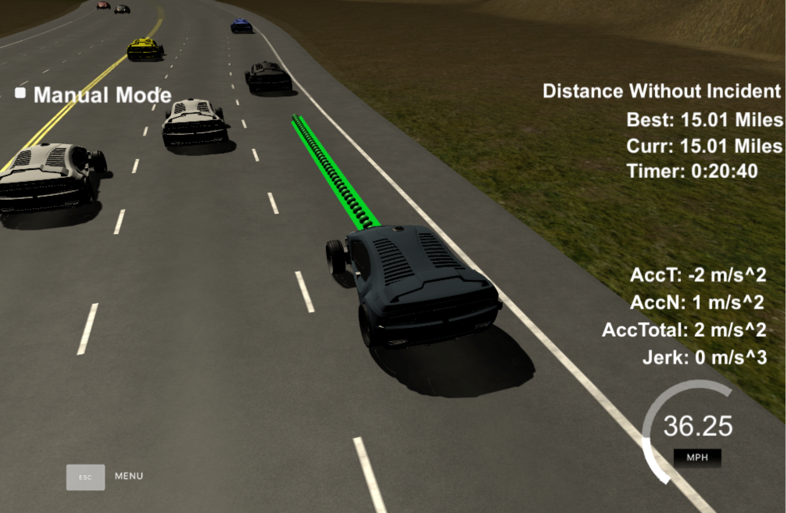

# Highway Driving with Traffic for Self Driving Cars

## Pipeline
The goal is to safely navigate around a virtual highway with other traffic that is driving +-10 MPH of the 50 MPH speed limit. The car should try to go as close as possible to the 50 MPH speed limit, which means passing slower traffic when possible, note that other cars will try to change lanes too. The car should avoid hitting other cars at all cost as well as driving inside of the marked road lanes at all times, unless going from one lane to another. The car should be able to make one complete loop around the 6946m highway. Since the car is trying to go 50 MPH, it should take a little over 5 minutes to complete 1 loop. Also the car should not experience total acceleration over 10 m/s^2 and jerk that is greater than 10 m/s^3.

The autonomous car takes a map (sparse highway coordinates), localization data (GPS coordinates) and sensor fusion data (traffic coordinates) as input. It predicts a safe, collision-free trajectory the vehicle travels in the next second. The algorithm works at around 15Hz i.e. a new trajectory is generated approximately every .067 seconds. [Udacity's self driving car simulator environment](https://github.com/udacity/self-driving-car-sim) is used for this project which uses a perfect controller and will visit every (x,y) point exactly. An efficient algorithm is able to handle communication latency (1-3 timesteps) from simulator environment and the car can sucessfully navigate traffic on the highway.

The steps of this project are the following:
* Use sensor fusion data to generate predicted trajectories for other vehicles on road for next 1s.
* Select the best behavior for the vehicle using Finite State Machine.
* Plan a safe Minimum-Jerk Trajectory trajectory for the car to execute optimal behavior.

The important files in the project are:
* `main.cpp` establishes communication to simulator environment using WebSocket.
* `algo.h` contains code for Behavior Planning and Trajectory Prediction.
* `helper.h` provides important functionality like Frame transformation (Absolute vs Frenet) and Waypoint lookup.
* `spline.h` is a simple cubic spline interpolation library.
---

## Step 1- Prediction
First the `PredictionModule()` function uses sensor fusion data to generate predictions for other vehicles on road. It returns a vector of predicted trajectories which it believes will happen in next 1 second. A constant velocity kinematic model is used to make predictions. 

## Step 2- Behavior Planning
The algorithm calls `select_states()` function which returns the best action it believes for the vehicle using a Finite State Machine. The returned states can be Keep Lane(KC), Lane Change Left(LCL), Lane Change Right(LCR) or Slowing Down(SLOW). The decision making logic is extremely simple. The algorithm first checks for cars in front of EGO vehicle. If it doesn't find any cars, it selects KL state. If a car is found to be blocking the lane, the algorithm checks for cars in left lane and then right lane. If adjacent lanes are empty LCL or LCR states are selected. However, if both the lanes are full, the algorithm selects the SLOW state.

Decisions making is much easier and straightforward in the Frenet frame than the World frame. The threshold distance to count a car as obstacle in same lane is 20m. The adjascent lane is considered blocked if a car is within 25m. The rate of accleration and braking are constants values i.e. 0.3g and 0.15g. These hyperparameters can be tuned to make the car behavior more agressive or defensive.

## Step 3- Trajectory Generation
The optimal state selected by Behavior Planner module is passed to the `generate_trajectory()` function. This function is tasked with generating an apt path for the vehicle to follow according to selected state. The lane change manuvers are generated using spline.h library. Higher order continuity of the trajectory is very important to minimize jerk and ensure occupant safety and comfort.

## Results
The algorithm works pretty well for majority of the cases and was successfully able to drive the 4.32 miles track without incident. The EGO vehicle can be made more intellegent using more states in future, especially for high traffic situations. Eg, sometimes the car gets stuck in leftmost lane due to traffic in left and middle lane even though the rightmost lane is empty. Adding a state for Find Gap in middle lane could be helphul in these situations.

Please first run the path_planning file and then the simulator environment. The program might bug out otherwise.